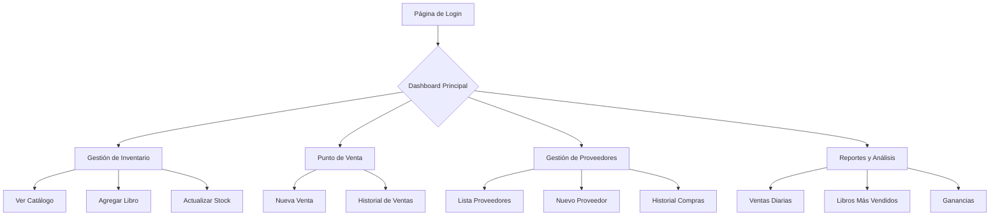

## 1. Visión General del Producto

Sistema de gestión integral para puesto de venta de libros en el centro de la ciudad. El sistema resolverá los problemas actuales de gestión de proveedores, inventario, ventas y reportes, eliminando el uso de Excel y papel.

El producto está diseñado para un dueño de negocio que utilizará un iPad Air de 11 pulgadas como dispositivo principal. El sistema será una aplicación web progresiva (PWA) que ofrecerá experiencia similar a una app nativa, accesible desde cualquier dispositivo con navegador web.

### Valor del Producto
- Automatización completa de la gestión del negocio
- Reducción de errores humanos en inventario y ventas
- Generación automática de reportes financieros
- Preparado para futura expansión con programa de fidelización de clientes

## 2. Funcionalidades Principales

### 2.1 Roles de Usuario

| Rol | Método de Registro | Permisos Principales |
|-----|-------------------|---------------------|
| Administrador (Dueño) | Registro inicial único | Acceso completo a todas las funciones del sistema |
| Empleado | Invitación por administrador | Gestión de ventas, consulta de inventario (sin acceso a reportes financieros) |

### 2.2 Módulos de Funcionalidad

El sistema de gestión del puesto de libros consta de las siguientes páginas principales:

1. **Dashboard Principal**: Vista general del negocio, métricas clave, acceso rápido a funciones
2. **Gestión de Proveedores**: Registro, edición y seguimiento de proveedores de libros
3. **Gestión de Inventario**: Control de stock de libros, entradas/salidas, búsqueda avanzada
4. **Punto de Venta (POS)**: Interfaz táctil optimizada para iPad, cálculo automático de precios
5. **Reportes y Análisis**: Ventas diarias/mensuales, libros más vendidos, ganancias
6. **Configuración**: Ajustes del sistema, gestión de usuarios

### 2.3 Detalles de Páginas

| Nombre de Página | Módulo | Descripción de Funcionalidad |
|------------------|---------|----------------------------|
| Dashboard Principal | Métricas del día | Muestra ventas del día, libros más vendidos, alertas de stock bajo |
| Dashboard Principal | Accesos rápidos | Botones directos para: nueva venta, agregar libro, ver proveedores |
| Gestión de Proveedores | Lista de proveedores | Tabla con nombre, teléfono, email, libros suministrados, estado |
| Gestión de Proveedores | Agregar/Editar proveedor | Formulario con validación de campos obligatorios |
| Gestión de Proveedores | Historial de compras | Registro de todas las compras realizadas a cada proveedor |
| Gestión de Inventario | Catálogo de libros | Grid visual con portadas, título, autor, precio, stock disponible |
| Gestión de Inventario | Búsqueda y filtros | Búsqueda por título, autor, ISBN, categoría, rango de precios |
| Gestión de Inventario | Entrada de stock | Formulario para registrar nuevas unidades de libros existentes |
| Gestión de Inventario | Nuevo libro | Formulario completo con imagen de portada, todos los datos del libro |
| Punto de Venta | Carrito de compras | Interfaz táctil grande con lista de libros, cantidades, precios |
| Punto de Venta | Cálculo automático | Suma total, aplicación de descuentos, cálculo de cambio |
| Punto de Venta | Métodos de pago | Efectivo, tarjeta, transferencia, con registro del método usado |
| Punto de Venta | Impresión de ticket | Generación de ticket de venta con todos los detalles |
| Reportes y Análisis | Ventas por período | Gráficos de ventas diarias, semanales, mensuales con comparativas |
| Reportes y Análisis | Libros más vendidos | Ranking de libros con mejor rotación |
| Reportes y Análisis | Análisis de ganancias | Margen de ganancia por libro y ganancias totales |
| Reportes y Análisis | Stock y rotación | Alertas de libros con baja rotación, sugerencias de reabastecimiento |
| Configuración | Gestión de usuarios | Alta/baja de empleados, asignación de permisos |
| Configuración | Ajustes del negocio | Nombre del negocio, horario, datos fiscales para tickets |

## 3. Flujo Principal del Usuario

### Flujo del Administrador (Dueño)
1. Inicio de sesión con credenciales seguras
2. Visualización del dashboard con métricas del día
3. Gestión diaria: revisión de inventario, registro de nuevos libros
4. Proceso de venta: uso del punto de venta táctil
5. Generación de reportes: análisis de ventas y ganancias
6. Gestión de proveedores: contacto y pedidos de reabastecimiento

### Flujo del Empleado
1. Inicio de sesión con credenciales asignadas
2. Acceso limitado solo a punto de venta y consulta de inventario
3. Procesamiento de ventas diarias
4. Sin acceso a reportes financieros detallados

## 4. Diseño de Interfaz de Usuario

### 4.1 Estilo de Diseño (Modern Flat Dark)
El diseño se basa en un tema oscuro moderno, minimalista y profesional, priorizando el contenido y la legibilidad.

- **Tema**: Oscuro profundo (Dark Mode First).
- **Colores principales**: 
    - Fondo: `#09090b` (Zinc 950) - Negro profundo, no absoluto.
    - Superficies: `#18181b` (Zinc 900) - Para tarjetas y contenedores.
    - Acento: `#6366f1` (Indigo 500) o `#3b82f6` (Blue 500) - Para acciones primarias y estados activos.
    - Texto: `#fafafa` (Zinc 50) para títulos, `#a1a1aa` (Zinc 400) para texto secundario.
- **Estilo visual**: 
    - **Flat**: Sin gradientes complejos ni efectos de vidrio (glassmorphism) pesados.
    - **Bordes**: Sutiles (`1px` sólido) en colores oscuros (`#27272a`) para separar áreas sin saturar.
    - **Sombras**: Muy suaves o inexistentes, confiando más en el contraste de color de fondo para la jerarquía.
    - **Esquinas**: Redondeadas moderadamente (`rounded-lg` o `rounded-xl`) para una apariencia moderna pero seria.
- **Tipografía**: Inter, Geist o similar. Sans-serif, limpia, con buen soporte para pesos variables.
- **Iconos**: Línea fina (Outline), consistentes (ej. Lucide React).

### 4.2 Resumen de Diseño por Página

| Nombre de Página | Módulo | Elementos de UI |
|------------------|---------|----------------|
| Login | Autenticación | Diseño minimalista. Fondo oscuro sólido o gradiente muy sutil. Tarjeta central de login con bordes limpios. Inputs de alto contraste sobre fondo oscuro. |
| Dashboard Principal | Métricas | Tarjetas planas (`bg-zinc-900`) con bordes sutiles (`border-zinc-800`). Números grandes en blanco, etiquetas en gris. Gráficos con colores de acento sobre fondo oscuro. |
| Dashboard Principal | Navegación | Sidebar oscuro fijo. Items de menú con estados hover/active claros (cambio de fondo o color de texto/icono). |
| Punto de Venta | Interfaz | Grid de productos limpio. Botones de acción grandes y planos. Contraste alto para legibilidad rápida. |
| Gestión | Tablas | Filas con hover sutil. Encabezados de tabla en gris oscuro. Acciones (editar/borrar) con iconos discretos. |

### 4.3 Adaptabilidad
- **Diseño desktop-first**: Optimizado para iPad Air 11 pulgadas (1194x834px)
- **Adaptación móvil**: Responsive para funcionar en tablets más pequeñas y smartphones
- **Interacción táctil**: Todos los elementos interactivos tendrán mínimo 44x44px (recomendación Apple)
- **Orientación**: Funcional tanto en portrait como landscape, con preferencia por landscape en POS

### 4.4 Preparación para PWA Futuro
- Manifest.json para instalación como app
- Service Worker para funcionamiento offline
- Cache de datos críticos (inventario, precios)
- Notificaciones push para alertas de stock bajo
