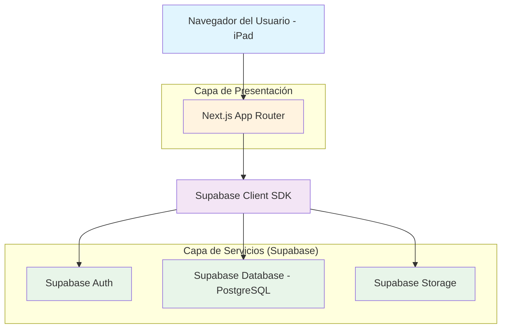
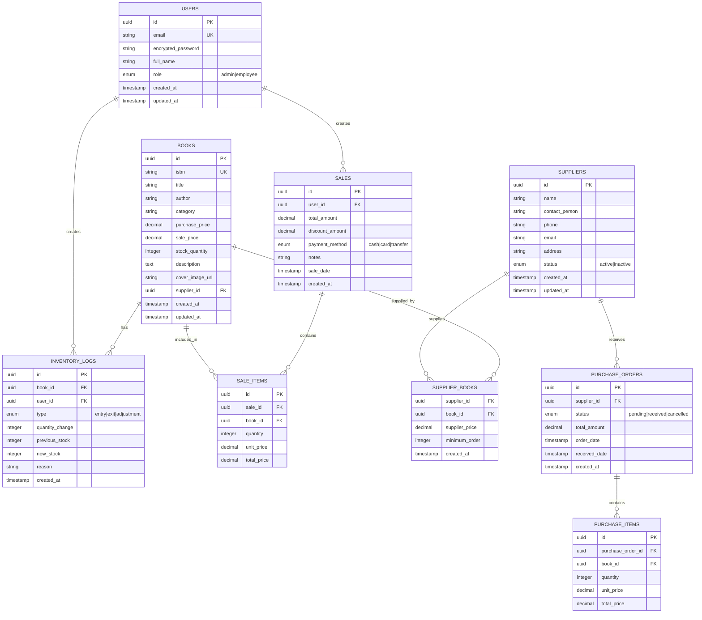

## 1. Diseño de Arquitectura



## 2. Descripción de Tecnologías

### Stack Tecnológico Principal

* **Frontend Framework**: Next.js 14 (App Router) + TypeScript 5

* **Estilos**: Tailwind CSS 3 (Tema Oscuro Flat)

* **Base de Datos**: Supabase (PostgreSQL 15)

* **Autenticación**: Supabase Auth (con soporte para email/password)

* **Almacenamiento**: Supabase Storage (para imágenes de portadas de libros)

* **ORM/Cliente**: Supabase Client SDK (tipo-safe)

* **Herramienta de Inicialización**: create-next-app con TypeScript

### Dependencias Esenciales

```json
{
  "dependencies": {
    "next": "^14.0.0",
    "react": "^18.2.0",
    "react-dom": "^18.2.0",
    "@supabase/supabase-js": "^2.38.0",
    "@supabase/auth-helpers-nextjs": "^0.8.0",
    "tailwindcss": "^3.3.0",
    "typescript": "^5.2.0",
    "lucide-react": "^0.290.0",
    "react-hook-form": "^7.47.0",
    "@hookform/resolvers": "^3.3.0",
    "zod": "^3.22.0",
    "date-fns": "^2.30.0",
    "recharts": "^2.8.0"
  }
}
```

## 3. Definición de Rutas

| Ruta                 | Propósito                             | Componente Principal             |
| -------------------- | ------------------------------------- | -------------------------------- |
| `/`                  | Login - Autenticación de usuarios     | `app/page.tsx`                   |
| `/dashboard`         | Dashboard principal con métricas      | `app/dashboard/page.tsx`         |
| `/inventory`         | Gestión de inventario de libros       | `app/inventory/page.tsx`         |
| `/inventory/add`     | Agregar nuevo libro al inventario     | `app/inventory/add/page.tsx`     |
| `/inventory/[id]`    | Editar libro específico               | `app/inventory/[id]/page.tsx`    |
| `/pos`               | Punto de Venta - Interfaz táctil      | `app/pos/page.tsx`               |
| `/suppliers`         | Lista de proveedores                  | `app/suppliers/page.tsx`         |
| `/suppliers/add`     | Agregar nuevo proveedor               | `app/suppliers/add/page.tsx`     |
| `/suppliers/[id]`    | Detalles del proveedor                | `app/suppliers/[id]/page.tsx`    |
| `/reports`           | Reportes y análisis                   | `app/reports/page.tsx`           |
| `/settings`          | Configuración del sistema             | `app/settings/page.tsx`          |
| `/api/auth/callback` | Callback de autenticación de Supabase | `app/api/auth/callback/route.ts` |

## 4. Estructura de Carpetas (Modular y Escalable)

```
src/
├── app/                          # Next.js App Router
│   ├── (auth)/                   # Rutas de autenticación
│   │   ├── page.tsx             # Login principal
│   │   └── callback/            # Callback de auth
│   ├── (dashboard)/             # Dashboard protegido
│   │   ├── dashboard/           # Vista principal
│   │   ├── inventory/           # Módulo de inventario
│   │   ├── pos/                 # Punto de venta
│   │   ├── suppliers/           # Gestión de proveedores
│   │   ├── reports/             # Reportes
│   │   └── settings/            # Configuración
│   ├── api/                     # API Routes (si necesario)
│   └── layout.tsx              # Layout principal
├── components/                   # Componentes reutilizables
│   ├── ui/                      # Componentes base (Botones, Inputs, Cards Flat Dark)
│   ├── dashboard/               # Componentes del dashboard
│   ├── inventory/               # Componentes de inventario
│   ├── pos/                     # Componentes del POS
│   ├── suppliers/              # Componentes de proveedores
│   └── reports/                  # Componentes de reportes
├── lib/                         # Utilidades y configuración
│   ├── supabase/               # Configuración de Supabase
│   │   ├── client.ts           # Cliente de Supabase
│   │   ├── server.ts           # Servidor de Supabase
│   │   └── middleware.ts       # Middleware de auth
│   ├── utils/                   # Utilidades generales
│   └── types/                   # Definiciones de tipos
├── hooks/                       # Custom hooks
│   ├── useInventory.ts         # Gestión de inventario
│   ├── useSales.ts             # Gestión de ventas
│   └── useAuth.ts              # Gestión de autenticación
├── services/                    # Servicios y lógica de negocio
│   ├── inventory.service.ts    # Lógica de inventario
│   ├── sales.service.ts        # Lógica de ventas
│   ├── supplier.service.ts     # Lógica de proveedores
│   └── report.service.ts       # Generación de reportes
└── middleware.ts               # Middleware global
```

## 5. Modelo de Datos

### 5.1 Diagrama Entidad-Relación



### 5.2 Definición de Tablas (DDL)

```sql
-- Tabla de Usuarios
CREATE TABLE users (
    id UUID PRIMARY KEY DEFAULT gen_random_uuid(),
    email VARCHAR(255) UNIQUE NOT NULL,
    encrypted_password VARCHAR(255) NOT NULL,
    full_name VARCHAR(255) NOT NULL,
    role VARCHAR(20) DEFAULT 'employee' CHECK (role IN ('admin', 'employee')),
    created_at TIMESTAMP WITH TIME ZONE DEFAULT NOW(),
    updated_at TIMESTAMP WITH TIME ZONE DEFAULT NOW()
);

-- Tabla de Libros
CREATE TABLE books (
    id UUID PRIMARY KEY DEFAULT gen_random_uuid(),
    isbn VARCHAR(20) UNIQUE NOT NULL,
    title VARCHAR(255) NOT NULL,
    author VARCHAR(255) NOT NULL,
    category VARCHAR(100) NOT NULL,
    purchase_price DECIMAL(10,2) NOT NULL,
    sale_price DECIMAL(10,2) NOT NULL,
    stock_quantity INTEGER DEFAULT 0,
    description TEXT,
    cover_image_url TEXT,
    supplier_id UUID REFERENCES suppliers(id),
    created_at TIMESTAMP WITH TIME ZONE DEFAULT NOW(),
    updated_at TIMESTAMP WITH TIME ZONE DEFAULT NOW()
);

-- Tabla de Proveedores
CREATE TABLE suppliers (
    id UUID PRIMARY KEY DEFAULT gen_random_uuid(),
    name VARCHAR(255) NOT NULL,
    contact_person VARCHAR(255),
    phone VARCHAR(50),
    email VARCHAR(255),
    address TEXT,
    status VARCHAR(20) DEFAULT 'active' CHECK (status IN ('active', 'inactive')),
    created_at TIMESTAMP WITH TIME ZONE DEFAULT NOW(),
    updated_at TIMESTAMP WITH TIME ZONE DEFAULT NOW()
);

-- Tabla de Ventas
CREATE TABLE sales (
    id UUID PRIMARY KEY DEFAULT gen_random_uuid(),
    user_id UUID REFERENCES users(id) NOT NULL,
    total_amount DECIMAL(10,2) NOT NULL,
    discount_amount DECIMAL(10,2) DEFAULT 0,
    payment_method VARCHAR(20) CHECK (payment_method IN ('cash', 'card', 'transfer')),
    notes TEXT,
    sale_date TIMESTAMP WITH TIME ZONE DEFAULT NOW(),
    created_at TIMESTAMP WITH TIME ZONE DEFAULT NOW()
);

-- Tabla de Items de Venta
CREATE TABLE sale_items (
    id UUID PRIMARY KEY DEFAULT gen_random_uuid(),
    sale_id UUID REFERENCES sales(id) NOT NULL,
    book_id UUID REFERENCES books(id) NOT NULL,
    quantity INTEGER NOT NULL,
    unit_price DECIMAL(10,2) NOT NULL,
    total_price DECIMAL(10,2) NOT NULL
);

-- Tabla de Logs de Inventario
CREATE TABLE inventory_logs (
    id UUID PRIMARY KEY DEFAULT gen_random_uuid(),
    book_id UUID REFERENCES books(id) NOT NULL,
    user_id UUID REFERENCES users(id) NOT NULL,
    type VARCHAR(20) CHECK (type IN ('entry', 'exit', 'adjustment')) NOT NULL,
    quantity_change INTEGER NOT NULL,
    previous_stock INTEGER NOT NULL,
    new_stock INTEGER NOT NULL,
    reason TEXT,
    created_at TIMESTAMP WITH TIME ZONE DEFAULT NOW()
);

-- Índices para mejorar rendimiento
CREATE INDEX idx_books_isbn ON books(isbn);
CREATE INDEX idx_books_title ON books(title);
CREATE INDEX idx_books_category ON books(category);
CREATE INDEX idx_sales_user_id ON sales(user_id);
CREATE INDEX idx_sales_sale_date ON sales(sale_date);
CREATE INDEX idx_sale_items_sale_id ON sale_items(sale_id);
CREATE INDEX idx_sale_items_book_id ON sale_items(book_id);
CREATE INDEX idx_inventory_logs_book_id ON inventory_logs(book_id);
CREATE INDEX idx_inventory_logs_created_at ON inventory_logs(created_at);

-- Políticas de seguridad de Supabase (RLS)
-- Permitir lectura a usuarios autenticados
ALTER TABLE books ENABLE ROW LEVEL SECURITY;
ALTER TABLE sales ENABLE ROW LEVEL SECURITY;
ALTER TABLE suppliers ENABLE ROW LEVEL SECURITY;

-- Políticas básicas
CREATE POLICY "Los usuarios autenticados pueden ver libros" ON books FOR SELECT TO authenticated USING (true);
CREATE POLICY "Los usuarios autenticados pueden ver ventas" ON sales FOR SELECT TO authenticated USING (true);
CREATE POLICY "Los usuarios autenticados pueden ver proveedores" ON suppliers FOR SELECT TO authenticated USING (true);
```

## 6. Configuración de Supabase

### Variables de Entorno (.env.local)

```bash
NEXT_PUBLIC_SUPABASE_URL=tu_proyecto.supabase.co
NEXT_PUBLIC_SUPABASE_ANON_KEY=tu_anon_key
SUPABASE_SERVICE_ROLE_KEY=tu_service_role_key
```

### Configuración de Cliente Supabase

```typescript
// lib/supabase/client.ts
import { createClientComponentClient } from '@supabase/auth-helpers-nextjs'
import { Database } from '@/lib/types/database'

export const supabase = createClientComponentClient<Database>()
```

## 7. Consideraciones de Rendimiento y Escalabilidad

### Optimizaciones para iPad

* Implementar virtualización en listas largas (react-window)

* Cache de imágenes con next/image

* Lazy loading de componentes pesados

* Optimización de bundle size con tree shaking

### Preparación para Microservicios Futuros

* Estructura modular que permite separar servicios

* API Routes preparadas para integraciones externas

* Sistema de eventos para comunicación entre servicios

* Base de datos normalizada para futuras expansiones

### Seguridad

* Autenticación mediante Supabase Auth

* Validación de datos con Zod schemas

* Sanitización de inputs

* HTTPS obligatorio en producción

* Rate limiting en APIs sensibles

## 8. Despliegue en Vercel

### Configuración de GitHub Actions

* CI/CD automático con GitHub

* Tests automatizados antes del despliegue

* Preview deployments para PRs

* Rollback automático en caso de errores

### Variables de Entorno en Vercel

* Configurar todas las variables de Supabase

* Variables de entorno según ambiente (dev/prod)

* Webhooks de Supabase para eventos en tiempo real
